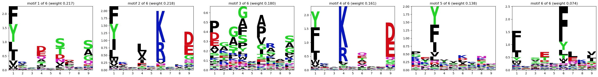

# EMMo

**E**xpectation-**M**aximization-based **Mo**tif finder.

## Description

Code repository for exploring unsupervised methods for:

- peptide-MHC binding motif identification,
- deconvolution of multi-allelic data, and
- peptide-MHC binding/presentation prediction.

The package contains Python implementations of the methods MixMHCp for MHC1 deconvolution (Gfeller
et al. 2018, J Immunol), MoDec for MHC2 deconvolution (Racle et al. 2019, Nat Biotechnol), and
MixMHC2pred for MHC2 binding prediction (Racle et al. 2019, Nat Biotechnol), with some
modifications, simplifications, and improvements.

## Installation

### Users

To install EMMo, you can run

```
pip install .
```

Precompiled models for peptide-MHC2 binding prediction can be downloaded from the GCP bucket to the
folder `models/binding_predictor`. These models can then be loaded in the `emmo predict-mhc2`
command-line script by simply providing their name instead of a full path, under the condition that
the `models` folder is in the correct relative location w.r.t. the package installation (i.e., the
same as in the repository). An option to ensure the latter is to download the complete repository
and install the package in editable mode. To this end, execute the following command in the root
directory of the repository.

```
pip install -e .
```

### Developers

#### Requirements

- [git](https://git-scm.com/book/en/v2/Getting-Started-Installing-Git)
- [Miniconda](https://docs.conda.io/en/latest/miniconda.html) - 23.5.2

#### Step-by-step

1. Clone the repository:

   ```bash
   git clone git@gitlab.com:instadeep/emmo.git && cd emmo
   ```

1. _[Only for dev changes]_ Create and activate the conda environment named `emmo_pre_commit`:

   ```bash
   conda env create -f .pre-commit-env.yaml && conda activate emmo_pre_commit
   ```

1. _[Only for dev changes]_ Install the pre-commit (make sure to have the conda environment
   activated)

   ```bash
   pre-commit install -t pre-commit -t commit-msg
   ```

1. _[Only for dev changes]_ Refer to the [contributing document](../CONTRIBUTING.md) for further
   contributing guidelines for the project.

#### Setup remote files support

1. Copy `.env.template` to `.env`

   ```bash
   cp .env.template .env
   ```

1. Copy json file with GCP credentials to `.credentials/biontech-tcr-16ca4aceba4c.json` (same file
   as the one used in BioNDeep).

## Usage (as a Command-line Tool)

Currently, the following commands are available:

- `emmo deconvolute-mhc2`
- `emmo predict-mhc2`

For more details and available parameters, run

```
emmo COMMAND --help
```

### Deconvolution and Motif Extraction

Example usage:

```
emmo deconvolute-mhc2
    --input_file peptides.txt
    --output_directory results
    --max_classes 6
    --motif_length 9
```

### MHC2 Binding Prediction

For a description of the precompiled models see
[MHC2 Binding Prediction Models](#mhc2-binding-prediction-models).

Example usage:

```
emmo pull-model --model_name gs://biondeep-models/emmo/binding_predictor/mhc2_msdb_2020_full_train_tune_ppm_recomputed_20230718

emmo predict-mhc2
    --input_file peptides_and_alleles.csv
    --output_file peptides_and_alleles_scored.csv
    --model mhc2_msdb_2020_full_train_tune_ppm_recomputed_20230718
```

If no alternative column names are provided to the `emmo predict-mhc2` command, it is assumed that
the input csv file contains the columns `peptide`, `allele_alpha`, and `allele_beta`. The alpha and
beta chain names must be in short format (e.g., `DRB10101` and `DRA0101`).

The output file will be a copy of the input file with the following additional columns (`[PREFIX]`
stands for the model name, i.e., `mhc2_msdb_2020_full_train_tune_ppm_recomputed_20230718` in the
example):

| Column              | Description                                                               |
| ------------------- | ------------------------------------------------------------------------- |
| `[PREFIX]_binding`  | Binding score using the PPM, background frequencies and offset weights.   |
| `[PREFIX]_offset`   | Best offset (0-based) for a 9-mer binding core.                           |
| `[PREFIX]_core`     | 9-mer core corresponding to the best offset.                              |
| `[PREFIX]_cleavage` | Cleavage score (capturing signals from the 3 N- and C-terminal residues). |
| `[PREFIX]_BC`       | Product of binding and cleavage score.                                    |

## Usage (as a Python library)

### Deconvolution and Motif Extraction

The following code snippet is an example of how to use the MHC2 motif deconvolution:

```python
from emmo.pipeline.sequences import SequenceManager
from emmo.em.mhc2_tf import EMRunnerMHC2   # omit the '_tf' for the non-tensorflow version

INPUT_FILE = 'peptides.txt'
OUTPUT_DIR = 'results'
MOTIF_LENGTH = 9
MIN_CLASSES = 1   # minimal and
MAX_CLASSES = 6   # maximal number of motifs to deconvolute

sequence_manager = SequenceManager.load_from_txt(INPUT_FILE)

for i in range(MIN_CLASSES, MAX_CLASSES + 1):
    output_dir_i = OUTPUT_DIR / f'classes_{i}'

    em_runner = EMRunnerMHC2(sequence_manager, MOTIF_LENGTH, i, 'MHC2_biondeep')
    em_runner.run(
        output_dir_i,
        n_runs=20,              # number of runs (with different random initializations)
        output_all_runs=False,  # whether to write results for all runs or just the best
                                # (highest log likelihood)
    )
```

If you have single-allelic data, you will probably just run the expectation-maximization algorithm
with one class to be identified, unless you want to study multiple specificities or reverse binding
using the ligands of a given allele.

You can then plot the result of the deconvolution:

```python
from emmo.models.deconvolution import DeconvolutionModelMHC2
from emmo.utils.viz import plot_mhc2_model

model = DeconvolutionModelMHC2.load(OUTPUT_DIR / 'classes_6')
plot_mhc2_model(model)
```



### MHC2 Binding Prediction

For a description of the precompiled models see
[MHC2 Binding Prediction Models](#mhc2-binding-prediction-models).

The predictor can be used as follows:

```python
import pandas as pd

# folder with precompiled models must be reachable
from emmo.constants import MODELS_DIRECTORY
from emmo.io.file import load_csv
from emmo.io.file import save_csv
from emmo.models.prediction import PredictorMHC2

# assumes that the file has columns 'peptide', 'allele_alpha', and 'allele_beta'
# (alleles formatted like 'DRB10101' and 'DRA0101')
df = load_csv('path/to/input.csv')

# load the model
predictor =  PredictorMHC2.load(
    MODELS_DIRECTORY / 'binding_predictor' /
    'mhc2_msdb_2020_full_train_tune_ppm_recomputed_20230718'
)

# run the prediction
df_scored = predictor.score_dataframe(
    df,
    column_prefix = 'emmo',     # prefix for the result columns
    pan_allelic = 'nearest',    # for unseen alleles, use PPM of the
                                # most similar seen allele (uses BLOSUM62)
    inplace = False,            # whether to add result columns directly to df
)

# write to file
save_csv(df_scored, "path/to/output.csv")
```

## Available models

### MHC2 Binding Prediction Models

Currently, there are four models, each trained on the merged train and tune partition of the BNT US
mono-allelic snapshot from 2020 (covering 84 alleles).

After having run the EM algorithm on the hits of each allele, there are 2 possibilities for
obtaining the motif - in form of a position probability matrix (PPM) - which are then used in the
predictor:

- the PPM output of the EM run (`direct`)
- taking all 9-mers cores estimated in the EM run and recomputing the PPM from these peptides with
  BLOSUM62-based pseudocounts (`recomputed`)

Moreover, the train, tune and test file that have been used so far for training the BioNDeep models
do not contain all hits from the MSDB. Instead, nested sets have been computed based on sequence
overlap, and only one representative of each nested set is retained (chosen at random among the
minimal-length peptides of each nested set). Since MoDec/EMMo have their own mechanism of dealing
with shared sequences (downweighting peptides that are overlapping with others), models were also
obtained using the full set of MHC2 ligands in the train and tune partition.

This results in the following models:

| Description                                | Location                                                                                              |
| ------------------------------------------ | ----------------------------------------------------------------------------------------------------- |
| PPM direct, representatives from nests     | `gs://biondeep-models/emmo/binding_predictor/mhc2_msdb_2020_nests_train_tune_ppm_direct_20230522`     |
| PPM recomputed, representatives from nests | `gs://biondeep-models/emmo/binding_predictor/mhc2_msdb_2020_nests_train_tune_ppm_recomputed_20230522` |
| PPM direct, full set                       | `gs://biondeep-models/emmo/binding_predictor/mhc2_msdb_2020_full_train_tune_ppm_direct_20230718`      |
| PPM recomputed, full set **[SOTA]**        | `gs://biondeep-models/emmo/binding_predictor/mhc2_msdb_2020_full_train_tune_ppm_recomputed_20230718`  |

After downloading a peptide-MHC2 binding prediction models using the `emmo pull-model` command, it
is available in the folder `models/binding_predictor`.

Example usage:

```
emmo pull-model --model_name gs://biondeep-models/emmo/binding_predictor/mhc2_msdb_2020_full_train_tune_ppm_recomputed_20230718
```
