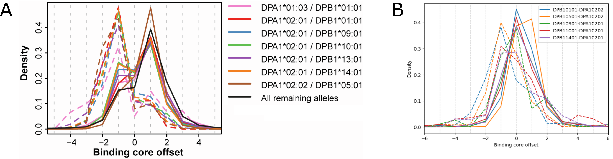

# Expectation-Maximization Algorithm

Fitting mixture models using expectation-maximization (EM) algorithms is a classical bioinformatics
approach to _de novo_ sequence motif discovery
[(Bailey and Elkan, 1994)](https://pubmed.ncbi.nlm.nih.gov/7584402/).

## EM-based deconvolution for MHC-I

EMMo implements a version of [MixMHCp](https://mixmhcp.org/#/submission)
[(Gfeller et al., 2019)](https://www.ncbi.nlm.nih.gov/pubmed/30429286), which is an EM-based method
for (i) identification of MHC-II binding core motifs and (ii) deconvolution of multi-allelic of
MHC-I ligand samples. The method takes as input a list of $N$ peptides and (a range of) the number
$K$ of classes, which correspond to the alleles/specificities that are expected to be contained in
the list. The EM algorithm then aims at maximizing the following log likelihood function:

$$
\log(\mathcal{L}) =
\log(\mathcal{L}_8) +
\log(\mathcal{L}_9) +
\log(\mathcal{L}_{10}) +
\dots +
\log(P(\theta))
$$

where $\log(\mathcal{L}_L)$ is the log likelihood of the $N_L$ peptides of length $L$ and
$P(\theta)$ is a prior term. For $L=9$, the full peptide sequence contributes to the log likelihood:

$$
\log(\mathcal{L}_9) = \sum_{n=1}^{N_9}
\log \left(
    \sum_{k=0}^{K}
    w_9^k
    \prod_{l=1}^{9}
    \theta_{
        l, x_l^n
    }^{k}
\right)
$$

For $L < 9$ (typically only $K=8$ is relevant here), only the first three and last two residues
contribute to the log likelihood:

$$
\log(\mathcal{L}_L) = \sum_{n=1}^{N_L}
\log \left(
    \sum_{k=0}^{K}
    w_L^k
    \prod_{l=1}^{3}
    \theta_{
        l, x_l^n
    }^{k}
    \prod_{l=8}^{9}
    \theta_{
        l, x_{l - (9 - L)}^n
    }^{k}
\right)
$$

For $L > 9$, also only the first three and last two residues contribute to the log likelihood. This
models that fact the ligands that are longer than $9$ amino acids usually bulge out of the MHC
binding groove in the middle while being anchored by the residues that are close to the N- and
C-terminus. Moreover, also the cases where a peptide "overhangs" on the either side of the binding
groove are considered, i.e., where the N- and/or C-terminus of the peptide is not aligned with the
motif $\theta$ to be inferred. In the log likelihood function, the maximum is taken over the
possible starting positions of the N-terminus and end positions of the C-terminus. Fixed penalties
$T_1$ and $T_2$, respectively, are used to model the fact that these cases are rare:

$$
\log(\mathcal{L}_L) = \sum_{n=1}^{N_L}
\log \left(
    \sum_{k=0}^{K}
    w_L^k
    \max_{
        \substack{S_1=0,\dots,L-9\\ S_2=S_1+7,\dots,L-2}
    }
    \left[
        T_1^{S_1}
        T_2^{L-2-S_2}
        \prod_{l=1}^{3}
        \theta_{
            l, x_{l+S_1}^n
        }^{k}
        \prod_{l=8}^{9}
        \theta_{
            l, x_{S_2 + l -7}^n
        }^{k}
    \right]
\right)
$$

The parameters to be fitted are:

- $\theta^k$, $1\le k\le K$, the $k$th binding core motif of length $9$
- $w_L^k$ the weight (or prior probability) of class $k$ for peptides of length $L$

Note that the $\theta_{l, i}^{0}$ are fixed. They model potential contaminant peptides and consist
of the amino acid frequencies in the human proteome (for a given residue $i$, the frequencies are
identical for all $l$).

There are a number of differences to the original algorithm in MixMHCp. Most notably, here, peptides
of all lengths are used to estimate the $\theta^k$ whereas in MixMHC, only the $9$-mers are used for
this purpose and the $w_L^k$ are estimated in separated EM runs with fixed $\theta^k$.

The EM algorithm computes so-called responsibilities during the expectation step in form of a matrix
of dimensions $(N,\; K + 1)$. These can be interpreted as the probabilities that the $n$th peptide
belongs to class $k$. The final class and core prediction is usually given by the maximal
responsibility value per peptide when the EM algorithm has converged.

For the initialization of an EM run, we randomly assign each peptide to a class $k$ (if possible,
ensuring that at least one peptide is assigned to each class). The EM algorithm then runs until the
log likelihood difference between two steps falls below a user-defined threshold (default at 1e-3).

Usually the EM algorithm is run multiple times with different initializations and the run with the
highest $\log(\mathcal{L})$ is reported as output.

## EM-based deconvolution for MHC-II

EMMo implements a version of [MoDec](https://github.com/GfellerLab/MoDec)
[(Racle et al., 2019)](https://www.nature.com/articles/s41587-019-0289-6), which is an EM-based
method adapted for the purpose of (i) identification of MHC-II binding core motifs and (ii)
deconvolution of multi-allelic of MHC-II ligand samples. The method takes as input a list of $N$
peptides and (a range of) the number $K$ of classes, which correspond to the alleles/specificities
that are expected to be contained in the list. The EM algorithm then aims at maximizing the
following log likelihood function:

$$
\log(\mathcal{L}) = \sum_{n=1}^{N}
\left(
    W^n \cdot
    \log \left(
        \sum_{k=0}^{K} \sum_{s=-S}^{S} w_{k,s}
        \prod_{l=1}^{L}
        \frac{
            \theta_{l, x_{l \bigoplus s}^{n}}^{k}
        }{
            f_{x_{l \bigoplus s}^{n}}
        }
    \right)
\right)
+ \log(P(\theta))
$$

The parameters to be fitted are:

- $\theta^k$, $1\le k\le K$, the $k$th binding core motif of length $L$
- $w_{k,s}$ the weight (or prior probability) of class $k$ and offset $s$

To account for the binding core offset preferences of MHC-II molecules towards the center of the
peptide, the offset weights $w_{k,s}$ to be fitted are shared between peptides of different lengths
and centered such that $s=0$ refers to the core that is exactly in the middle of the peptide. The
maximal shift $S$ from the center depends on the maximal peptide length in the sample and the
"special sum" $l \bigoplus s$ ensures the correct alignment of each peptide $x^n$, see
[(Racle et al., 2019, supplement)](https://www.nature.com/articles/s41587-019-0289-6). A fixed flat
motif $\theta_{l, i}^{0}$ models potential contaminant peptides and consist of the amino acid
frequencies in the human proteome. Similarly, the values $f_{i}^{n}$ are the fixed amino acid
frequencies observed in HLA-II ligands. Finally, $P(\theta)$ is a prior term and $W^n$ is a weight
assigned to the $n$th peptide intended to downweight peptides that share $9$-mers with other
peptides in the sample ($1/W^n$ is the average number of times each $9$-mer appears in the full
peptide list).

The EM algorithm computes so-called responsibilities during the expectation step in form of a matrix
of dimensions $(N,\; K +1,\; 2S +1)$. These can be interpreted as the probabilities that the $n$th
peptide belongs to class $k$ and its binding core offset is $s$. The final class and core prediction
is usually given by the maximal responsibility value per peptide when the EM algorithm has
converged.

Since the source code of MoDec is not available, some implementation details may differ in EMMo. For
example, we use a similar initialization for the responsibilities as for MHC-I (rather than randomly
initializing $\theta$ and $w_{k, s}$) and then start with a maximization step. To be specific, we
randomly assign each peptide to a class (if possible, ensuring that at least one peptide is assigned
to each class) and use a uniform distribution for the offset dimension of the responsibility matrix
(taking only the possible offsets for the respective peptide length into account). The EM algorithm
then runs until the log likelihood difference between two steps falls below a user-defined threshold
(default at 1e-3).

Usually the EM algorithm is run multiple times with different initializations and the run with the
highest $\log(\mathcal{L})$ is reported as output.

We identified a bias affecting the offset weights $w_{k,s}$ that is introduced in MoDec due to the
manner in which the peptides of different lengths are aligned. With the "special sum"
$l \bigoplus s$, the offset $s=0$ is skipped for peptides for which the peptide and motif length
difference is odd (here the binding core cannot be exactly centered within the peptide). As a
consequence, these peptides do not contribute to the middle offset weights which are obtained in the
maximization step by summing up the responsibility matrix along the peptide dimension and
normalizing.

In EMMo, we fix this issue by upweighting the middle offset weight (before normalization) by a
factor that is equal to the total effective number of peptides divided by the effective number of
peptides that contribute to the middle offset weight.

Panel A in the figure shows a the plot taken from
[Racle et al. (2023)](https://doi.org/10.1016/j.immuni.2023.03.009). The drop for offset $s=0$ is a
consequence of the above-described bias. The reproduction of the analysis using EMMo in panel B also
shows a slight shift of the distribution towards the N-terminus for the reverse binders, but without
the artificial drop at the middle offset. Similarly, another bias is introduced by the fact that
only the longer peptides contribute to offsets that are further away from zero. A possible future
experiment to fix this could be estimating a suitable offset weight distribution with the peptide
length and binding core offset as parameters instead of the current categorical distribution.
