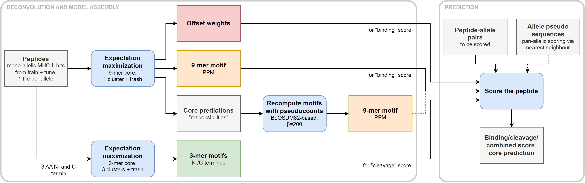

# Binding and Binding Core Prediction (MHC2)

EMMo implements an MHC2 binding prediction method that is similar to MixMHC2pred (version 1.0 to
1.2), which builds upon EM-based motif deconvolution
[(Racle et al., 2019)](https://www.nature.com/articles/s41587-019-0289-6).

## Original Method in MixMHC2pred (version 1.0 to 1.2)

After deconvolution, the estimated motifs for the multi-allelic samples must be assigned to alleles
in a semi-automated manner using co-occurrences and exclusion principles across all samples. Then
$9$-mer binding core motifs are recomputed for each allele using the union of all peptides assigned
to this allele and BLOSUM62-based pseudocounts. This results in a motif for each allele seen during
training. The offset weights $w_{k,s}$ output by MoDec are averaged and shared between the alleles.
"Binding scores" can then be computed for peptide-allele pairs using the equation:

$$
\textrm{BindingScore}_{n}^{a} =
\left(
    \sum_{s=-S}^{S} w_{k,s}
    \prod_{l=1}^{L}
    \frac{
        \theta_{l, x_{l \bigoplus s}^{n}}^{a}
    }{
        f_{x_{l \bigoplus s}^{n}}
    }
\right)
$$

The binding score is thus obtained as the sum over all valid offsets and the binding core prediction
is given by the maximum value.

MixMHC2pred also uses a term that is intended to model signals from the N- and C-termini of the
peptides, to which we refer here as "cleavage scores":

$$
\textrm{CleavageScore}_{n} =
\left(
    \sum_{k=0}^{3} w_{k}^{N}
    \prod_{l=1}^{3}
    \frac{
        \nu_{l, x_{l}^{n}}^{k}
    }{
        f_{x_{l}^{n}}
    }
\right)
\cdot
\left(
    \sum_{k=0}^{3} w_{k}^{C}
    \prod_{l=\lambda^{n}-2}^{\lambda^{n}}
    \frac{
        \gamma_{l, x_{l}^{n}}^{k}
    }{
        f_{x_{l}^{n}}
    }
\right)
$$

This term consists of six $3$-mer motifs $\nu^k$ and $\gamma^k$, three for the N-terminus and three
for the C-terminus, which are obtained by running MoDec with $K=L=3$ on the union of all
tree-amino-acid N- and C-termini, respectively, across all samples. Here, $\lambda^{n}$ is the
length of the $n$th peptide. The final score in MixMHC2pred is then given by the product of the
"binding" and "cleavage score":

$$
\textrm{PresentationScore}_{n}^{a} =
\textrm{BindingScore}_{n}^{a} \cdot \textrm{CleavageScore}_{n}
$$

## Method in EMMo

We essentially follow the above-described pipeline to obtain a predictor similar to MixMHC2pred and
trained on BNT mass spec data. However, due to the large amount of single-allelic data, we only run
the deconvolution with EMMo per allele using the latter data and thus can omit the potentially
error-prone motif-to-allele alignment step. In a few cases (4 out of 84 alleles in case of the 2020
MSDB snapshot), the motifs produced with EMMo (and also the ones produced with MoDec) appear to be
shifted in the sense the they do not match with the actual binding core motif. In these cases, EMMo
is rerun with more than one class/motif to be estimated which typically results in one of the motifs
displaying the expected anchor positions. These motifs are then used for the predictor. The overall
pipeline is illustrated in the following figure:

Another advantage of using single-allelic data is that we can directly use the PPMs ($\theta$) that
are output by EMMo (which we refer to as "direct"). However, we also recomputed the PPM using the
BLOSUM62-based pseudocounts as described by
[Racle et al. (2019)](https://www.nature.com/articles/s41587-019-0289-6) (which we refer to as
"recomputed"). So far, we observed the best performance for the models that use recomputed PPMs.
