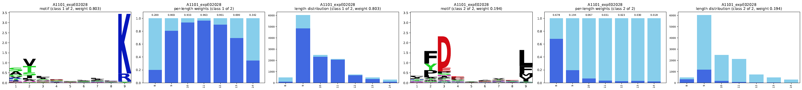

# Identification of contaminants

The list of peptides obtained in a mass spec experiment typically contains both false positives (in
terms of the interpretation of the mass spectra) and contaminants (i.e., peptides that were
physically present in the mass spec experiment but not bound to the expected MHC molecules). The
former are addressed by setting a strict FDR threshold and considering additional metrics to improve
the peptide calling (predicted vs. observed HPLC retention time and/or fragment ion intensities).
The contaminants are partially addressed by using simple filters (lists of known contaminant
proteins, length ranges, tryptic peptides, etc.).

Remaining sources of contaminants include:

- [MHC1 ligands in MHC2 ligandomics data](#mhc1-ligands-in-mhc2-ligandomics-data) (and possibly vice
  versa)
- [peptides from unexpected alleles](#peptides-from-unexpected-alleles), mostly other alleles in
  single-allelic data that are not expected to be present (resulting from issues with the experiment
  such as incomplete removal of the cell line's original MHC molecules or spill over)
- misannotation of the sample's alleles (swapping of MHC annotations, typos, etc.)
- peptides that were not presented by any MHC allele (missed contaminant proteins, etc.)

## MHC1 ligands in MHC2 ligandomics data

For some MHC2 mass spec experiments, motif deconvolution produces clusters that consist of MHC1
ligands. They can be identified by their typical MHC1 anchor positions and also by the corresponding
length distribution that peaks at 9-mers. An explanation for seeing MHC1 ligands in MHC2 ligandomics
data is the experimental procedure, in particular, the use of the same instruments and devices for
MHC1 and MHC2 experiments.

EMMo contains functions to annotate this type of contamination in a semi-automated manner. A
challenge is to select the right $K$, i.e., the number of clusters/motifs that shall be identified
by the decovolution algorithm. In [MoDec](https://github.com/GfellerLab/MoDec)
[(Racle et al., 2019)](https://www.nature.com/articles/s41587-019-0289-6), the Akaike information
criterion (AIC) is used to identify the optimal $K$:

$$
\textrm{AIC} = 2k - \ln(\hat{L})
$$

where $k$ is the number of estimated parameters and $\hat{L}$ is the likelihood under the model.

However, we observed that the model with the best AIC often has too few motifs resulting in clusters
containing MHC1 and MHC2 ligands.

Therefore, EMMo implements the following heuristic strategy, which assumes that increasing $K$
preserves the identification of clusters that are dominated by 9-mers:

1. Perform deconvolution for every mass spectrometry experiment using a range of values for $K$. The
   minimal value for $K$ is naturally set to 1, while the maximal value, $K_{\max}$, must be
   determined by the user. Increasing $K_{\max}$ will result in longer run times and a higher
   likelihood of generating noisy motifs or clusters that may not correspond to HLA alleles,
   especially for experiments with fewer ligands. For single-allelic experiments, a lower $K_{\max}$
   (e.g., $K_{\max}=3$) is sufficient, whereas multi-allelic experiments require a higher
   $K_{\max}$.
1. For each experiment, identify the model $K^{*}$ with the best AIC.
1. For each experiment, peptide, and model $1 \le K \le K_{\max}$, annotate the peptide as
   _K-contaminant_ if
   - The peptide is part of a cluster with
     - Length mode $\le9$, or
     - Length mode $=10$ and offset shift $+1$ towards the C-terminus (typical for 9-mer motifs from
       10mer MHC1 ligands).
   - This cluster is not the flat motif.
   - The peptide length is $\le 12$.
1. Annotate a peptide in an experiment as _contaminant_ if the peptide is $K$-contaminant for every
   $K \ge K^{*}$.

### Usage in EMMo

The heuristic described above is implemented in the `emmo.dataset_processing.contaminants` module.
The function `annotate_mhc1_contaminants_in_mhc2_ligandomics` extracts the peptides from the
`responsibilities.csv` files in the model directories and annotates them to identify potential MHC1
contaminants. The following code snippet is an example of how to use it:

```python
from emmo.dataset_processing.contaminants import (
    annotate_mhc1_contaminants_in_mhc2_ligandomics
)
from emmo.io.output import find_deconvolution_results

# find deconvolution results for all experiments and all numbers of clusters (K)
# in the specified directory
df_models = find_deconvolution_results("path/to/per_experiment_deconvolution_results")

# annotate peptides in the responsibility files whether they are potential contaminants
# according the the heuristic strategy
df_annotated_all = annotate_mhc1_contaminants_in_mhc2_ligandomics(df_models=df_models)
```

The resulting DataFrame will contain the following columns (only a subset is listed here):

- `group` - the group identifier (e.g., the experiment ID) from the directory names
- `peptide` - the peptide sequence
- `number_of_classes_best_aic` - the best number of classes $K^*$ for the group according to AIC
- `mhc1_contaminant_best_aic` - `True` if the peptide was annotated as $K^*$-contaminant (see
  above), `False` otherwise
- `mhc1_contaminant_annotation_consensus` - `True` if the peptide was annotated as contaminant (see
  above), `False` otherwise

## Peptides from unexpected alleles

MHC ligandomics data usually comes with the information on which alleles have been present in the
cell line or sample (or which alleles have been pulled down). Ideally, each obtained peptide would
have been bound to one of those alleles. However, for some mass spec experiments, we observe motifs
from alleles that should not have been present. The corresponding peptides can also be considered as
contaminants.

Ligands from contaminant alleles have been observed in single-allelic MHC1 data, especially for
certain cell lines. A typical method to generate single-allelic data is to re-introduce the allele
of interest into a cell line that was genetically engineered to not express any MHC alleles. In some
cases, the original alleles of the cell lines still seem to be present:

- Cell line **C1R** is known to have minimal HLA-B\*35:03 and normal levels of HLA-C\*04:01 cell
  surface expression (see e.g. [this publication](https://doi.org/10.3389/fimmu.2021.653710)).
- Cell line B721.221 supposedly does not express any HLA-I alleles (see
  [this website](https://www.cellosaurus.org/CVCL_6263)). However, we observe contaminant motifs
  that appear to be HLA-C\*01:02. This allele is among the HLA-I alleles of the parent cell line
  [LCL 721](https://www.cellosaurus.org/CVCL_2102) of B721.221.

For example, here is the deconvolution result ($K=2$) for a single-allelic experiment for
HLA-A\*11:01 where C1R was used. While motif 1 is the motif of the expected allele HLA-A\*11:01,
there is a clear second motif for HLA-C\*04:01.



Increasing $K$ to $3$ usually produces a third motif corresponding to the second allele,
HLA-B\*35:03, that is still expressed in C1R.


We follow a simple heuristic strategy to identify peptides from unexpected alleles:

- We define a set of reference motifs for individual alleles (e.g., by manual curation of the motifs
  from deconvolution runs on single-allelic mass spec data
- We define a set $C$ of contaminant types to identify, including
  - HLA-C\*04:01 in C1R
  - HLA-B\*35:03 in C1R
  - HLA-C\*01:02 in B721
  - ...
- Given a peptide for a mass spec experiment for which contaminant types $C' \subseteq C$ must be
  considered, we apply likelihood scoring with
  - the original model of their deconvolution run (for simplicity, we use $K=1$), giving
    likelihood/score $S$, and
  - for each contaminant type $c\in C'$, a model consisting only of the motif of the respective
    contaminant allele (e.g., the motif obtained from HLA-C\*04:01 experiments), giving
    likelihood/score $S_c$
- If $S_c > S$ for the peptide and some $c\in C'$, then this peptide is annotated as contaminant

### Usage in EMMo

The semi-automated annotation of contaminant peptides from unexpected alleles requires the
configuration of per-allele reference motifs and the contaminant types.

#### Per-allele reference motifs

The curation of reference motifs for alleles is still a manual process. Based on the output
directory of per-group (in this case per-allele) deconvolution, the motifs are selected using a YAML
config file. By default, for a given allele, the motif in the deconvolution run for $K=1$ is
selected. Selection of motifs from runs with $K\ge 2$ or whether to exclude an allele completely
must be specified in the config file. Reasons for such manual selections include the removal of the
contribution of contaminant peptides.

<details>
  <summary>Example config: Motif selection</summary>

The example is a manual curated collection for MSDB 2024-10 v1 (Fiigment MSDB), single-allelic MHC1
data, per-allele deconvolution $1\le K\le 3$. Additional available alleles are included with the
single motif in the run with $K=1$.

```yaml
A1101:
  keep: true
  classes: 2
  motif: 2
  comment: "remove C0401 contamination (C1R cell line)"
A2407:
  keep: true
  classes: 2
  motif: 2
  comment: "remove C0102 contamination (B721.221 cell line)"
A7401:
  keep: true
  classes: 2
  motif: 2
  comment: "remove C0102 contamination (B721.221 cell line)"
B1502:
  keep: true
  classes: 2
  motif: 1
  comment: "remove C0401 contamination (C1R cell line)"
C0102:
  keep: true
  classes: 2
  motif: 2
  comment: "remove C0401 contamination (C1R cell line)"
C0202:
  keep: true
  classes: 2
  motif: 1
  comment: "remove C0401 contamination (C1R cell line)"
C0303:
  keep: true
  classes: 2
  motif: 2
  comment: "remove C0401 contamination (C1R cell line)"
C0304:
  keep: true
  classes: 2
  motif: 1
  comment: "remove C0401 contamination (C1R cell line)"
C0401:
  keep: true
  classes: 2
  motif: 1
  comment: "remove B3503 contamination (C1R cell line)"
C0501:
  keep: true
  classes: 2
  motif: 1
  comment: "remove B3503 contamination (C1R cell line)"
C0602:
  keep: true
  classes: 2
  motif: 2
  comment: "remove C0401 contamination (C1R cell line)"
C0701:
  keep: true
  classes: 2
  motif: 1
  comment: "remove C0401 contamination (C1R cell line)"
C0702:
  keep: true
  classes: 2
  motif: 2
  comment: "remove C0401 contamination (C1R cell line)"
C0704:
  keep: true
  classes: 2
  motif: 1
  comment: "remove putative B3701 contamination"
C1203:
  keep: true
  classes: 2
  motif: 1
  comment: "remove C0401 contamination (C1R cell line)"
C1402:
  keep: true
  classes: 2
  motif: 2
  comment: "remove C0401 contamination (C1R cell line)"
C1502:
  keep: true
  classes: 2
  motif: 1
  comment: "remove C0401 contamination (C1R cell line)"
C1601:
  keep: true
  classes: 2
  motif: 1
  comment: "remove C0401 contamination (C1R cell line)"
C1701:
  keep: true
  classes: 2
  motif: 2
  comment: "remove C0401 contamination (C1R cell line)"
E0101:
  keep: false
  comment: "motif appears to be contaminant C0401 (C1R cell line)"
G0101:
  keep: true
  classes: 2
  motif: 1
  comment: "remove C0401 contamination (C1R cell line)"
```

</details>

#### Contaminant types

The contaminant types to be identified can also be defined in a YAML file. Each type needs:

- `identifier` - a unique identifier
- `column` - the column in the experiments table to decide whether a contaminant type is relevant
  for a specific experiment (can be "cell_type", "allele", "experiment_id", etc.)
- `value` - the value to filter for in `column`
- `value_match` - how to match `value` with the entries in `column` (default: "equals")
- `contaminant_allele` - the contaminant allele in compact format

Additionally, and `exclude` block can be defined to define exclusion rules. For example,
single-allelic experiments for HLA-C\*04:01 that were conducted using C1R should be excluded from
identifying HLA-C\*04:01 contaminant peptides.

<details>
  <summary>Example config: Contaminant types</summary>

```yaml
contaminant_alleles:
  # cell line C1R, allele C*04:01
  - identifier: C1R_C0401
    column: cell_type
    value: C1R
    value_match: contains_insensitive
    contaminant_allele: C0401
    exclude:
      column: allele
      value: C0401
      value_match: equals
  # cell line C1R, allele B*35:03
  - identifier: C1R_B3503
    column: cell_type
    value: C1R
    value_match: contains_insensitive
    contaminant_allele: B3503
    exclude:
      column: allele
      value: B3503
      value_match: equals
  # cell line B721.221, allele C*01:02
  - identifier: B721_C0102
    column: cell_type
    value: B721
    value_match: contains_insensitive
    contaminant_allele: C0102
    exclude:
      column: allele
      value: C0102
      value_match: equals
  # experiment expE00970, allele B*37:01
  - identifier: expE00970_B3701
    column: experiment_id
    value: expE00970
    value_match: equals
    contaminant_allele: B3701
```

</details>

#### Annotation

Peptides are finally annotated using the function `annotate_peptides_from_unexpected_alleles`. The
following inputs are required:

- per-experiment deconvolution runs directory (containing the peptides to annotate in the
  `responsibilities.csv` files)
- experiments table (containing columns `experiment_id` to merge deconvolution runs + any column
  specified in the contaminant types config file)
- reference per-allele deconvolution runs
- corresponding motif selection config (see above)
- contaminant types config file (see above)

```python
from emmo.dataset_processing.contaminants import annotate_peptides_from_unexpected_alleles

df_models, df_peptides = annotate_peptides_from_unexpected_alleles(
    path_deconvolution_runs="path/to/per_experiment_deconv_directory",
    path_experiments_table="path/to/experiment_table.csv",
    path_deconvolution_runs_reference="path/to/per_allele_deconv_directory",
    path_motif_selection_config="path/to/motif_selection_config.yml",
    path_contaminant_types_config="path/to/contaminant_types_config.yml",
    path_plot_results="path/to/output_directory/summary_plot.pdf",
)
```
