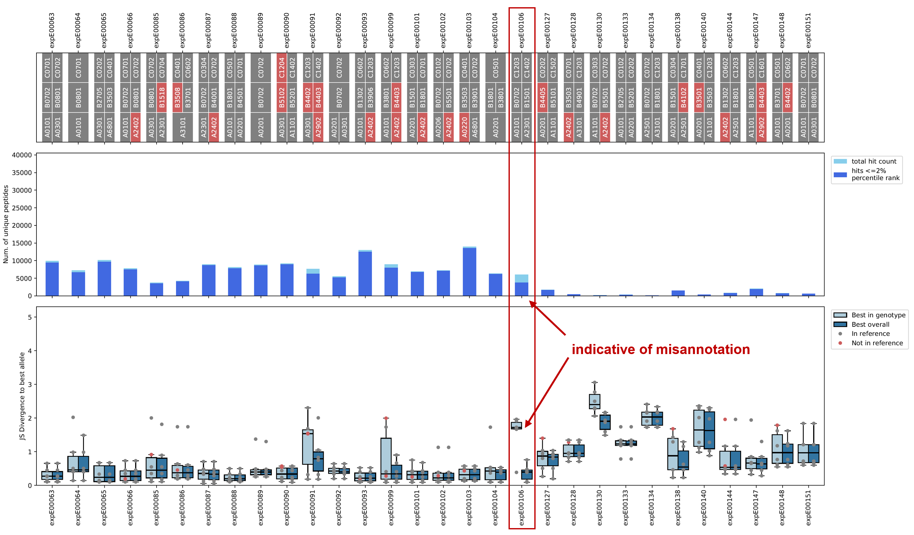
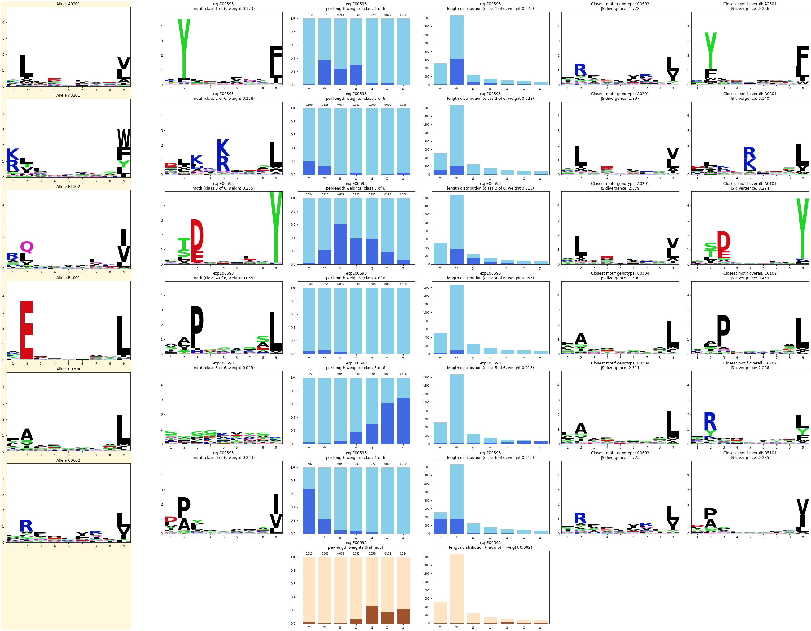

# Misannotation of MHC alleles

## Background

Mass spec databases typically contain MHC annotations that were at some point manually collected and
curated from the source publications or internal experiments. Therefore, the allele information may
contain errors such as swapped HLA genotypes, typos, etc.

De novo motif deconvolution as implemented in EMMo can be used to identify such issues by comparing
the deconvoluted motifs to a set of curated reference motifs.

## Method description

### Motif similarity

A motif in EMMo is typically represented by a position probability matrix (PPM). A PPM is an
$L \times |A|$ matrix where $L$ is the motif length and $A$ is the alphabet (here, typically, the
set of amino acids). Following [Nettling et al. (2015)](https://doi.org/10.1186/s12859-015-0767-x),
we use the Jensen-Shannon (JS) divergence to compare two PPMs.

The JS divergence is a method of measuring the similarity between two probability distributions. It
is a symmetrized and smoothed version of the Kullback–Leibler (KL) divergence. The JS divergence of
two motifs $p$ and $q$ at position $\ell$ is given by

$$
H_{\ell}
\; = \;
\frac{1}{2} \sum_{a \in A} p_{\ell, a}\; \log \frac{p_{\ell, a}}{m_{\ell, a}}
\; + \;
\frac{1}{2} \sum_{a \in A} q_{\ell, a}\; \log \frac{q_{\ell, a}}{m_{\ell, a}}
$$

where

$$
m_{\ell, a} = \frac{p_{\ell, a} + q_{\ell, a}}{2}
$$

is a mixture distribution of $p$ and $q$.

We define a scalar dissimilarity value $D$ for a pair of motifs as the sum of the JS divergence over
all positions:

$$
D = \sum_{\ell = 1}^{L} H_{\ell}.
$$

### Motif comparison

For identifying experiments with potential misannotations, the following inputs are needed:

- (Multi-allelic) experiments to be investigated
  - Motif deconvolution results
  - MHC annotation for each experiment (from the mass spec database)
- Reference alleles with corresponding motifs (PPMs)

The reference alleles and motifs can for example be obtained by running motif deconvolution on
single-allelic mass spec experiments followed by manual investigation of the results and selection
of individual motifs for each allele. See documentation page
[Reference motifs](../reference_motifs.md).

For each experiment, the deconvoluted motifs (considering some fixed number $K$ of classes/clusters
that has been used in the deconvolution) are compared with motifs associated with the reference
alleles:

1. Across the annotated MHC alleles of that experiment (taken from the database)
2. Across all reference alleles

In option 1, if a given allele is not available in the set of reference alleles, the closest
available allele in terms of a BLOSUM-based distance of the pseudosequences is used instead.

This approach results in $2 \times K$ distance values (JS divergence) for each experiment, which can
be plotted using functions implemented in EMMo (see examples below).

## Usage in EMMo

> **NOTE** At the moment, this functionality is only implemented for MHC1.

### Motif matching

As a first step, the best matching alleles and motifs are computed with the corresponding motif
distances (JS divergence).

```python
from emmo.dataset_processing.contaminants.motif_matching import match_motifs_to_reference

df_distances = match_motifs_to_reference(
    # multi-allelic data to be analyzed
    path_deconvolution_runs="path/to/deconvolution_runs.csv",
    path_metadata_table="path/to/experiments_metadata_table.csv",

    # reference alleles and motifs
    path_per_allele_reference="path/to/per_allele_deconv_directory",
    path_per_allele_reference_selection="path/to/motif_selection_config.yml",

    mhc_class=1,
    number_of_classes=6,
    metadata_group_column="experiment_id",
    metadata_alleles_column="allele",
)

df_distances.to_csv("path/to/motif_distances.csv", index=False)
```

### Overview plot

The best matching alleles and the distances serve as input (`df_distances`) for generating the
overview plot.

The ratio of the number of predicted binders vs. the total number of peptides in a mass spec
experiment can also indicate low-quality experiments or experiments with misannotations. Therefore,
EMMo allows inputting a table `df_hit_counts` with columns:

- `group` - Experiment ID
- `num_of_hits_total` - Total number of peptides for the group
- `num_of_hits_below_threshold` - Number of predicted binders (e.g., peptides that are below a
  certain percentile rank threshold)

Example usage:

```python
from emmo.pipeline.model_selection import load_selected_ppms
from emmo.utils.viz.allele_misannotation import plot_group_motif_distances

# load the motif matching results
df_distances = pd.read_csv("path/to/motif_distances.csv")

# optional to enrich the plot:
# load the per-experiment hit/peptide counts (total number and predicted binders)
df_hit_counts = pd.read_csv("path/to/hit_counts.csv")

# optional to enrich the plot:
# load the reference alleles and motifs
allele2ppm = load_selected_ppms(
    models_directory="path/to/per_allele_deconv_directory",
    selection_path="path/to/motif_selection_config.yml",
    mhc_class=1,
)

# plot and save
plot_group_motif_distances(
    df_distances,
    file_path="path/to/output_plot.pdf",
    df_hit_counts=df_hit_counts,
    max_groups_per_page=30,
    allele_column="allele",
    alleles_in_reference=allele2ppm,
    used_pct_rank_threshold=2,
)
```

The following is an example plot (first page only) where all possible types of input have been
provided (i.e., including MHC allele annotations and total peptide / predicted binder counts).



Experiment `expE00106` is highlighted here because it displays two characteristics that have been
found to be indicative of allele misannotation:

- Low ratio of predicted binders vs. total hit count
- Distances to the best annotated alleles ("genotype") are much higher than the distances to the
  best alleles from the full reference set ("overall")

In the function `plot_group_motif_distances`, the parameter `sort_by_distance="ratio"` can be set to
sort the experiments by the ratio of the medians of "genotype" vs "overall" in descending order.
That way, candidates for misannotations appear first.

### Individual experiments

The expected, deconvoluted, and best-matching motifs can be investigated per experiment:

```python
from emmo.utils.viz.allele_misannotation import MotifComparisonPlotter

# load `df_distances` and `allele2ppm` as before

motif_comparison_plotter = MotifComparisonPlotter(
    df_distances=df_distances,
    allele2reference_motif=allele2ppm,
    mhc_class=1,
    allele_column="allele",
)

motif_comparison_plotter.plot("expE00593", save_as="path/to/output_plot.pdf")
```

Example plot:



The columns in the plot are the following:

| Category                  | Column | Description                                                                                             |
| ------------------------- | ------ | ------------------------------------------------------------------------------------------------------- |
| **Expected motifs**       | 1      | Expected motifs (taken from the reference motifs) according to the MHC annotation                       |
| **Deconvolution results** | 2      | Motifs                                                                                                  |
|                           | 3      | Per-length class weights (prior likelihoods for each deconvolution class estimated in the EM algorithm) |
|                           | 4      | Length distribution (total counts and number of peptides assigned to the respective class/motif)        |
| **Best matching motifs**  | 5      | Across the annotated alleles ("genotype")                                                               |
|                           | 6      | Across the full set of reference alleles ("overall")                                                    |
