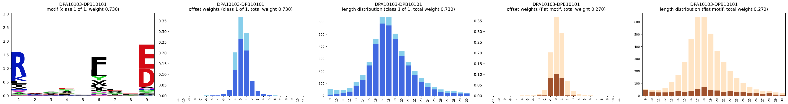

# MHC-II Deconvolution and Motif Extraction

There are multiple commands related to MHC-II deconvolution. For an explanation of the method, see
[this page](../explanations/em_algorithm.md).

## Simple Deconvolution of a Peptide List

The simplest version is running the command `deconvolute-mhc2` which performs the deconvolution on
the full list of input sequences that are provided as a text file without any headers
(`-i, --input_file`). You also need to specify:

- the output directory (`-o, --output_directory`),
- the maximal number of classes for which to run the deconvolution (`-l, --max_classes`, the default
  min. number is 1), and
- the number of EM runs to perform per number of classes (`-n, --number_of_runs`).

```bash
emmo deconvolute-mhc2
    --input_file peptides.txt
    --output_directory results
    --max_classes 6
    --number_of_runs 20
```

The output folder contains one directory for each number of classes
(`classes_{min_classes}, ..., classes_{max_classes}`) that each contain the model from the best EM
out of the `number_of_runs` that were done.

For a description of additional arguments, use

```bash
emmo deconvolute-mhc2 --help
```

## Per-allele Deconvolution

The command `deconvolute-per-allele-mhc2` expect as input a CSV file (`-i, --input_file`) with
columns for:

- peptide (expected column default: `peptide`),
- allele alpha chain in compact format (expected column default: `allele_alpha`), and
- allele beta chain in compact format (expected column default: `allele_alpha`).

The command has the same required arguments as `deconvolute-mhc2`. However, the output directory
contains one folder per allele (alpha-beta pair) which in turn contains the folders for the
different numbers of classes.

By default, the background amino acid frequencies (used in the log likelihood function that is
maximized) are obtained from the full list of peptides across all alleles.

Use the flag `--plot`, to plot the deconvolution results in a subdirectory `plots` of the output
directory.

For more details, run

```bash
emmo deconvolute-per-allele-mhc2 --help
```

The plots can also be obtained afterwards by running the command
`plot-deconvolution-per-allele-mhc2` with the output directory of the per-allele deconvolution as
input directory (`-i, --input_directory`).

In both cases, one plot for each combination of genes (DP, DQ, and DR; depending on the available
alleles) and number of classes. Each row corresponds to one allele. The following figure shows the
first row from a per-allele deconvolution with one class/motif and gene DP:



For each class, the following plots are available:

- PPM in form of a Kullback-Leibler motif/logo plot using the same background amino acid
  distribution as used during the deconvolution (not show for the flat motif as it would be empty),
- Offset weights that are also estimated during the deconvolution where
  - $= 0$ correspond to the motif being exactly in the middle of the sequence
  - $< 0$ means that the motif is closer to the N-terminus
  - $> 0$ means that the motif is closer to the C-terminus
- Length distribution of the peptides assigned to the class (via best responsibility)

**Note:** For the offset weights and length distribution, the darker parts of the bars are the
relevant parts that belong to the respective class, whereas the full bars (darker and lighter parts)
show the cumulated offset weights and length distribution across all classes (incl. the flat motif).

## Deconvolution for MHC-II Cleavage Model

The command `deconvolute-for-cleavage-mhc2` runs the deconvolution and model compilation for the
"cleavage score", which uses short motifs (PPMs) derived from the N- and C-termini of peptides, see
[this page](../explanations/prediction_mhc2.md).

For more details, run

```bash
emmo deconvolute-for-cleavage-mhc2 --help
```
