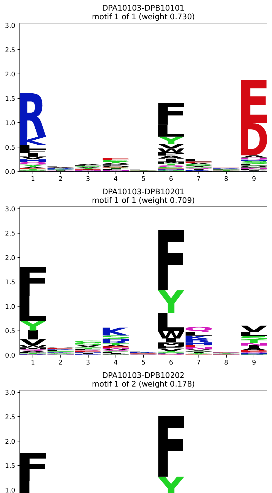
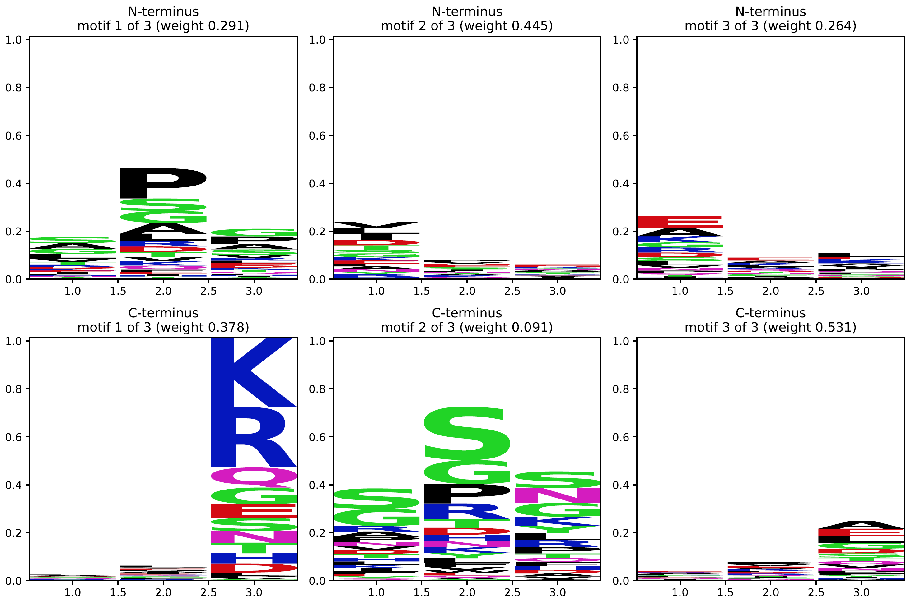

# MHC-II Binding Prediction

There are multiple commands related to MHC-II deconvolution. For an explanation how the standard
MHC2 predictor works, see [this page](../explanations/prediction_mhc2.md).

## Prediction with Available Models

EMMo predictor models are store in the following GS bucket (subdirectory):

```
gs://biondeep-models/emmo
```

For a description of the precompiled models see
[MHC2 Binding Prediction Models](../models/general.md). The models can be pulled using the
`pull-model` command. Example usage:

```bash
emmo pull-model --model_name gs://biondeep-models/emmo/binding_predictor/mhc2_msdb_2020_full_train_tune_ppm_recomputed_20230718
```

Once the model was pulled (into the `{path_to_repository}/models` folder), it can be used in the
`predict-mhc2` via the argument `--model {model_name}`. Alternatively, the bucket path point to the
model directory can be provided directly (the model is pulled and saved temporarily in this case).

```bash
emmo predict-mhc2
    --input_file peptides_and_alleles.csv
    --output_file peptides_and_alleles_scored.csv
    --model mhc2_msdb_2020_full_train_tune_ppm_recomputed_20230718
```

If no alternative column names are provided to the `emmo predict-mhc2` command, it is assumed that
the input csv file contains the columns `peptide`, `allele_alpha`, and `allele_beta`. The alpha and
beta chain names must be in short format (e.g., `DRB10101` and `DRA0101`).

The output file will be a copy of the input file with the following additional columns (`[PREFIX]`
stands for the model name, i.e., `mhc2_msdb_2020_full_train_tune_ppm_recomputed_20230718` in the
example):

| Column              | Description                                                               |
| ------------------- | ------------------------------------------------------------------------- |
| `[PREFIX]_binding`  | Binding score using the PPM, background frequencies and offset weights.   |
| `[PREFIX]_offset`   | Best offset (0-based) for a 9-mer binding core.                           |
| `[PREFIX]_core`     | 9-mer core corresponding to the best offset.                              |
| `[PREFIX]_cleavage` | Cleavage score (capturing signals from the 3 N- and C-terminal residues). |
| `[PREFIX]_BC`       | Product of binding and cleavage score.                                    |

## Predictor Compilation

The `compile-predictor-mhc2` command compiles a predictor from per-allele deconvolution results
(`-i, --input_directory`) and a cleavage model (`-c, --cleavage_model_path`), see
[this page](./cli_deconvolution.md) on how to obtain these.

By default, the single motif from the deconvolution with one class is selected for each allele. This
selection can be overridden for individual alleles by providing a YAML file via the
`-s, --selection_path` argument. This manual selection of alternative motifs can be useful in the
following cases:

- The default motif does not display the expected anchor positions for the allele but instead e.g.
  signal from protein digestion with trypsin.
- The default motif is shifted w.r.t. the binding core (which sometimes becomes evident from
  inspection of closely related genes and/or higher-class-number deconvolution results).
- The allele shall not be considered at all because e.g. the deconvolution results indicate a poor
  quality of the associated experiments.

The YAML file must have the following structure:

```yaml
DPA10103-DPB10202:
  keep: true
  classes: 2
  motif: 1
  comment: "default selection displays signal from tryptic digestion"
DQA10301-DQB10401:
  keep: false
  comment: "motif possibly shifted by 2 towards N-terminus"
```

You can remove complete alleles from the selection using `keep: false`. Alternatively motifs from
deconvolution runs with more than one class can be selected by specifying

- `classes`: number of classes for which the deconvolution was done, excl. the flat motif, and
- `motif`: the (1-based) index of the motif from this deconvolution that shall be selected.

The `comment` field is optional.

The `compile-predictor-mhc2` command has the following optional arguments and flags:

| Argument / flag                 | Description                                                                                                                                                                                            |
| ------------------------------- | ------------------------------------------------------------------------------------------------------------------------------------------------------------------------------------------------------ |
| `-o, --output_directory {path}` | Local or remote output directory in which the predictor directory is saved. By default, the compiled predictor is saved in the `{path_to_repository}/models/binding_predictor` directory.              |
| `-n, --name_prefix {prefix}`    | Prefix for the predictor directory. If this is not provided, the name of the input directory is used.                                                                                                  |
| `-r, --recompute_ppms`          | Recompute the position probability matrices from the core predictions in the deconvolution runs. The `responsibilities.csv` file must be contained in the respective deconvolution models directories. |
| `--plot`                        | Plot a summary of the predictor in the subdirectory                                                                                                                                                    |

The is one summary plot for each gene (DP, DQ, and DR; depending on the available alleles) and one
for the cleavage model.

First part of an example summary plot for gene DP:



Example summary plot for a cleavage model:



A compiled predictor can be push to the GS bucket using

```bash
emmo push-model --model_name {model_name}
```

where `model_name` can be either the name of a model directory in
`{path_to_repository}/models/binding_predictor` or the full path to a model directory at an
arbitrary location. In any case, the model is uploaded to
`gs://biondeep-models/emmo/binding_predictor/`.

## Prediction with Deconvolution Results

In some cases, it might be desired to use (per-allele) deconvolution results with all of their
motifs and specific class and offset weight. This can be achieved with the
`predict-from-deconvolution-models-mhc2` command.

For more details, run

````bash
emmo predict-from-deconvolution-models-mhc2 --help
```
````
