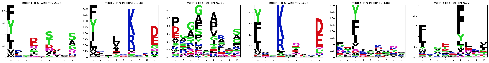

# Usage as a Python Library

## Deconvolution and Motif Extraction

The following code snippet is an example of how to use the MHC2 motif deconvolution:

```python
from emmo.pipeline.sequences import SequenceManager
from emmo.em.mhc2_c import EMRunnerMHC2   # omit the "_c" for the Python implementation

INPUT_FILE = "peptides.txt"
OUTPUT_DIR = "results"
MOTIF_LENGTH = 9
MIN_CLASSES = 1   # minimal and
MAX_CLASSES = 6   # maximal number of motifs to deconvolute

sequence_manager = SequenceManager.load_from_txt(INPUT_FILE)

for i in range(MIN_CLASSES, MAX_CLASSES + 1):
    output_dir_i = OUTPUT_DIR / f"classes_{i}"

    em_runner = EMRunnerMHC2(sequence_manager, MOTIF_LENGTH, i, "MHC2_biondeep")
    em_runner.run(
        output_dir_i,
        n_runs=20,              # number of runs (with different random initializations)
        output_all_runs=False,  # whether to write results for all runs or just the best
                                # (highest log likelihood)
    )
```

If you have single-allelic data, you will probably just run the expectation-maximization algorithm
with one class to be identified, unless you want to study multiple specificities or reverse binding
using the ligands of a given allele.

You can then plot the result of the deconvolution:

```python
from emmo.models.deconvolution import DeconvolutionModelMHC2
from emmo.utils.viz import plot_mhc2_model

model = DeconvolutionModelMHC2.load(OUTPUT_DIR / "classes_6")
plot_mhc2_model(model)
```



## MHC2 Binding Prediction

For a description of the precompiled models see
[MHC2 Binding Prediction Models](#mhc2-binding-prediction-models).

The predictor can be used as follows:

```python
import pandas as pd

# folder with precompiled models must be reachable
from emmo.constants import MODELS_DIRECTORY
from emmo.io.file import load_csv
from emmo.io.file import save_csv
from emmo.models.prediction import PredictorMHC2

# assumes that the file has columns "peptide", "allele_alpha", and "allele_beta"
# (alleles formatted like "DRB10101" and "DRA0101")
df = load_csv("path/to/input.csv")

# load the model
predictor =  PredictorMHC2.load(
    MODELS_DIRECTORY / "binding_predictor" /
    "mhc2_msdb_2020_full_train_tune_ppm_recomputed_20230718"
)

# run the prediction
df_scored = predictor.score_dataframe(
    df,
    column_prefix = "emmo",     # prefix for the result columns
    pan_allelic = "nearest",    # for unseen alleles, use PPM of the
                                # most similar seen allele (uses BLOSUM62)
    inplace = False,            # whether to add result columns directly to df
)

# write to file
save_csv(df_scored, "path/to/output.csv")
```
